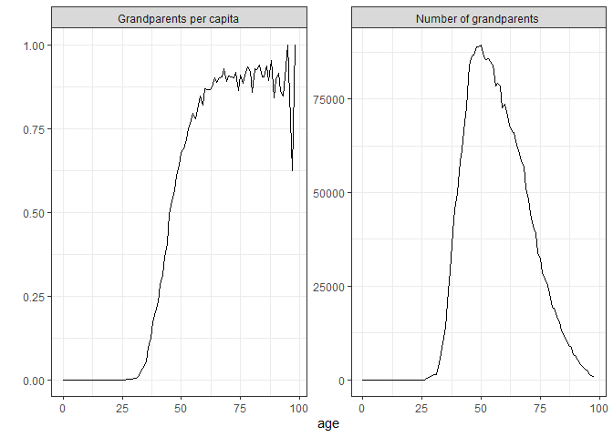
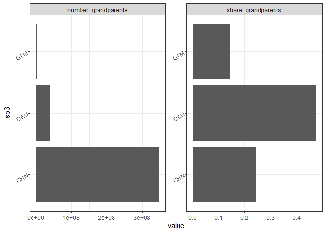

Expected number of grandparents
================
Diego Alburez-Gutierrez (MPIDR);
Nov 23 2022

  - [1. Installation](#1-installation)
  - [2. Number of kin](#2-number-of-kin)
  - [3. Average number of
    granpdarent/grandchildren](#3-average-number-of-granpdarentgrandchildren)
  - [4. Age differences between grandparents and
    granchildren](#4-age-differences-between-grandparents-and-granchildren)
  - [5. Number of grandparentes in a
    population](#5-number-of-grandparentes-in-a-population)
  - [References](#references)

We will use matrix kinship models in a time-variant framework (Caswell
and Song 2021) to compute the expected number of grandparents and
grandchildren in a range of countries and the related kin dependencies.

The code runs in R, preferably in RStudio.


# 1\. Installation

Install the [development version](https://github.com/IvanWilli/DemoKin)
of DemoKin from GitHub (could take \~1 minute). We made changes to the
`DemoKin` package recently. If you had already installed the package,
please uninstall it and and install it again.

``` r
# remove.packages("DemoKin")
# install.packages("devtools")
devtools::install_github("IvanWilli/DemoKin", build_vignettes = TRUE)
```

Load packages:

``` r
library(DemoKin)
library(dplyr)
library(tidyr)
library(purrr)
library(ggplot2)
library(countrycode)
library(knitr)
```

Define a function to get necessary data from the UNWPP

``` r
get_UNWPP_inputs <- function(countries, my_startyr, my_endyr, variant = "Median"){
  
  
  print("Getting API ready...")
  # Get data from UN using API
  
  base_url <- 'https://population.un.org/dataportalapi/api/v1'
  
  # First, identify which indicator codes we want to use
  
  target <- paste0(base_url,'/indicators/?format=csv')
  codes <- read.csv(target, sep='|', skip=1) 
  
  qx_code <- codes$Id[codes$ShortName == "qx1"]
  asfr_code <- codes$Id[codes$ShortName == "ASFR1"]
  pop_code <- codes$Id[codes$ShortName == "PopByAge1AndSex"]
  
  # Get location codes
  
  target <- paste0(base_url, '/locations?sort=id&format=csv')
  df_locations <- read.csv(target, sep='|', skip=1)
  
  # find the codes for countries
  
  my_location <- 
    df_locations %>% 
    filter( Name %in% countries) %>% 
    pull(Id) %>% 
    paste(collapse = ",")
  
  # Get px values
  
  print(paste0("Getting mortality data for ", paste(countries, collapse = ", ")))
  
  my_indicator <- qx_code
  my_location  <- my_location
  
  target <- paste0(base_url,
                   '/data/indicators/',my_indicator,
                   '/locations/',my_location,
                   '/start/',my_startyr,
                   '/end/',my_endyr,
                   '/?format=csv')
  
  px <- 
    read.csv(target, sep='|', skip=1) %>% 
    filter(Variant %in% variant) %>% 
    filter(Sex == "Female") %>% 
    mutate(px = 1- Value) %>% 
    select(Location, Time = TimeLabel, age = AgeStart, px)
  
  # ASFR
  
  print(paste0("Getting fertility data for ", paste(countries, collapse = ", ")))
  
  my_indicator <- asfr_code
  
  target <- paste0(base_url,
                   '/data/indicators/',my_indicator,
                   '/locations/',my_location,
                   '/start/',my_startyr,
                   '/end/',my_endyr,
                   '/?format=csv')
  
  asfr <- 
    read.csv(target, sep='|', skip=1) %>% 
    filter(Variant %in% variant) %>% 
    select(Location, Time = TimeLabel, age = AgeStart, ASFR = Value)
  
  data <- 
    px %>% 
    left_join(asfr, by = c("Location", "Time", "age")) %>% 
    mutate(ASFR = replace(ASFR,is.na(ASFR),0)) 
  
  data
}

# To get UN population
get_unwpp_pop <- function(countries,  my_startyr = 2022, my_endyr = 2022){
  base_url <- 'https://population.un.org/dataportalapi/api/v1'
  
  # First, identify which indicator codes we want to use
  
  target <- paste0(base_url,'/indicators/?format=csv')
  codes <- read.csv(target, sep='|', skip=1) 
  
  pop_code <- codes$Id[codes$ShortName == "PopByAge1AndSex"]
  
  # Get location codes
  
  target <- paste0(base_url, '/locations?sort=id&format=csv')
  df_locations <- read.csv(target, sep='|', skip=1)
  
  # find the codes for countries
  iso3 <- countrycode(countries, origin = "country.name", destination = "iso3c")
  
  locs <- 
    df_locations %>% 
    filter(Iso3 %in% iso3) %>% 
    pull(Id) 
  
  my_location <- paste(locs, collapse = ",")
  
  print(paste0("Getting pop data for ", paste(countries, collapse = ", ")))
  
  
  # Avoid overwhelming UN APi
  if(length(countries) <= 20){
    
    my_indicator <- pop_code
    my_location  <- my_location
    
    target <- paste0(base_url,
                     '/data/indicators/',my_indicator,
                     '/locations/',my_location,
                     '/start/',my_startyr,
                     '/end/',my_endyr,
                     '/?format=csv')
    
    pop <- 
      read.csv(target, sep='|', skip=1) %>% 
      filter(Variant == "Median") %>% 
      select(iso3 = Iso3, country = Location, year = TimeLabel, age = AgeStart, sex = Sex, value = Value)
    
  } else{
    print("Many countries, I'll process in batch")
    
    my_indicator <- pop_code
    
    times <- floor(length(locs)/10)
    sp_vec <- rep(1:10, times)
    extras <- length(locs) - length(sp_vec)
    if(extras > 0) sp_vec <- c(sp_vec, 1:extras)
    
    my_location_l  <- split(locs, sp_vec)
    
    pop <- 
      lapply(1:length(my_location_l), function(n, my_location_l){
        
        print(paste0("Processing batch ", n, "/", length(my_location_l) ))
        
        loc_n <- paste(my_location_l[[n]], collapse = ",")
        
        target <- paste0(base_url,
                         '/data/indicators/',my_indicator,
                         '/locations/', loc_n,
                         '/start/',my_startyr,
                         '/end/',my_endyr,
                         '/?format=csv')
        
        pop <- read.csv(target, sep='|', skip=1)
        
        Sys.sleep(1)
        pop
      }, my_location_l) %>% 
      bind_rows() %>% 
      filter(Variant == "Median") %>% 
      select(iso3 = Iso3, country = Location, year = TimeLabel, age = AgeStart, sex = Sex, value = Value)
    
  }
  
  return(pop) 
  
}
```

# 2\. Number of kin

Let’s get the numbers of China, Guatemala, and Germany:

``` r
# pick countries
countries <- c("China", "Guatemala", "Germany")

# Year range

my_startyr   <- 1950
my_endyr     <- 2022

data <- get_UNWPP_inputs(
  countries = countries
  , my_startyr = my_startyr
  , my_endyr = my_endyr
  )
```

    ## [1] "Getting API ready..."
    ## [1] "Getting mortality data for China, Guatemala, Germany"
    ## [1] "Getting fertility data for China, Guatemala, Germany"

Run kinship models for 2022 period:

``` r
period_kin_temp <- 
  data %>%
  split(list(.$Location)) %>%
  map_df(function(X){
    print(unique(X$Location))
    U <-
      X %>%
      select(Time, age, px) %>%
      pivot_wider(names_from = Time, values_from = px) %>%
      select(-age) %>% 
      as.matrix()
    f <- X %>%
      select(Time, age, ASFR) %>%
      mutate(ASFR = ASFR/1000) %>% 
      pivot_wider(names_from = Time, values_from = ASFR) %>%
      select(-age) %>% 
      as.matrix()
    kin(U, f, time_invariant = FALSE, output_kin = c("gm","gd"), output_period = 2022)$kin_summary %>%
      mutate(Location = unique(X$Location),  .before = 1)
  })
```

    ## [1] "China"

    ## Stable assumption was made for calculating pi on each year because no input data.

    ## Warning: replacing previous import 'lifecycle::last_warnings' by
    ## 'rlang::last_warnings' when loading 'hms'

    ## Assuming stable population before 1950.

    ## [1] "Germany"

    ## Stable assumption was made for calculating pi on each year because no input data.

    ## Assuming stable population before 1950.

    ## [1] "Guatemala"

    ## Stable assumption was made for calculating pi on each year because no input data.
    ## Assuming stable population before 1950.

The model is for female populations along matrilineal lines, but
following Caswel (2022), we can use Keyfitz factors to multiply kin and
obtain male and female kin accordingly. This is a good-enough
approximation:

``` r
period_kin <- 
  period_kin_temp %>% 
  select(Location, kin, year, age_focal, count_living) %>% 
  mutate(
    count_living = count_living*4
    , kin = ifelse(kin == "gm", "grandparents", "grandchildren"))
```

# 3\. Average number of granpdarent/grandchildren

Now we can visualise the expected number of grandchildren and
grandparents for an average member of the population surviving to each
age. For example, a Chinese woman aged 50 has on average, 0.72
grandchildren and 0.08 living grandparents. Visually:

``` r
period_kin %>% 
  ggplot(aes(x = age_focal, y = count_living, color = Location)) +
  geom_line(size = 2) + 
  scale_x_continuous("Age of Focal (average member of the population)") +
  scale_y_continuous("Average number of kin in 2022") +
  facet_grid(~kin) + 
  theme_bw() +
  theme(legend.position = "bottom")
```

<!-- -->

As a table:

``` r
period_kin %>% 
  mutate(count_living = round(count_living, 2)) %>% 
  pivot_wider(names_from = kin, values_from = count_living) %>% 
  select(-year) %>% 
  kable()
```

| Location  | age\_focal | grandchildren | grandparents |
| :-------- | ---------: | ------------: | -----------: |
| China     |          0 |          0.00 |         3.78 |
| China     |          1 |          0.00 |         3.76 |
| China     |          2 |          0.00 |         3.74 |
| China     |          3 |          0.00 |         3.71 |
| China     |          4 |          0.00 |         3.69 |
| China     |          5 |          0.00 |         3.66 |
| China     |          6 |          0.00 |         3.63 |
| China     |          7 |          0.00 |         3.61 |
| China     |          8 |          0.00 |         3.57 |
| China     |          9 |          0.00 |         3.53 |
| China     |         10 |          0.00 |         3.48 |
| China     |         11 |          0.00 |         3.43 |
| China     |         12 |          0.00 |         3.38 |
| China     |         13 |          0.00 |         3.33 |
| China     |         14 |          0.00 |         3.28 |
| China     |         15 |          0.00 |         3.24 |
| China     |         16 |          0.00 |         3.18 |
| China     |         17 |          0.00 |         3.11 |
| China     |         18 |          0.00 |         3.03 |
| China     |         19 |          0.00 |         2.94 |
| China     |         20 |          0.00 |         2.85 |
| China     |         21 |          0.00 |         2.78 |
| China     |         22 |          0.00 |         2.68 |
| China     |         23 |          0.00 |         2.59 |
| China     |         24 |          0.00 |         2.50 |
| China     |         25 |          0.00 |         2.41 |
| China     |         26 |          0.00 |         2.31 |
| China     |         27 |          0.00 |         2.18 |
| China     |         28 |          0.00 |         2.09 |
| China     |         29 |          0.00 |         1.99 |
| China     |         30 |          0.00 |         1.89 |
| China     |         31 |          0.00 |         1.70 |
| China     |         32 |          0.00 |         1.54 |
| China     |         33 |          0.00 |         1.41 |
| China     |         34 |          0.00 |         1.29 |
| China     |         35 |          0.00 |         1.17 |
| China     |         36 |          0.00 |         1.05 |
| China     |         37 |          0.00 |         0.93 |
| China     |         38 |          0.00 |         0.81 |
| China     |         39 |          0.01 |         0.70 |
| China     |         40 |          0.01 |         0.58 |
| China     |         41 |          0.02 |         0.48 |
| China     |         42 |          0.03 |         0.39 |
| China     |         43 |          0.05 |         0.32 |
| China     |         44 |          0.08 |         0.27 |
| China     |         45 |          0.13 |         0.22 |
| China     |         46 |          0.19 |         0.18 |
| China     |         47 |          0.27 |         0.15 |
| China     |         48 |          0.39 |         0.12 |
| China     |         49 |          0.53 |         0.10 |
| China     |         50 |          0.72 |         0.08 |
| China     |         51 |          0.91 |         0.06 |
| China     |         52 |          1.12 |         0.05 |
| China     |         53 |          1.33 |         0.04 |
| China     |         54 |          1.57 |         0.03 |
| China     |         55 |          1.83 |         0.02 |
| China     |         56 |          2.07 |         0.01 |
| China     |         57 |          2.29 |         0.01 |
| China     |         58 |          2.48 |         0.01 |
| China     |         59 |          2.65 |         0.00 |
| China     |         60 |          2.80 |         0.00 |
| China     |         61 |          2.93 |         0.00 |
| China     |         62 |          3.05 |         0.00 |
| China     |         63 |          3.17 |         0.00 |
| China     |         64 |          3.27 |         0.00 |
| China     |         65 |          3.38 |         0.00 |
| China     |         66 |          3.49 |         0.00 |
| China     |         67 |          3.63 |         0.00 |
| China     |         68 |          3.80 |         0.00 |
| China     |         69 |          4.00 |         0.00 |
| China     |         70 |          4.24 |         0.00 |
| China     |         71 |          4.50 |         0.00 |
| China     |         72 |          4.79 |         0.00 |
| China     |         73 |          5.10 |         0.00 |
| China     |         74 |          5.45 |         0.00 |
| China     |         75 |          5.79 |         0.00 |
| China     |         76 |          6.16 |         0.00 |
| China     |         77 |          6.47 |         0.00 |
| China     |         78 |          6.78 |         0.00 |
| China     |         79 |          7.04 |         0.00 |
| China     |         80 |          7.25 |         0.00 |
| China     |         81 |          7.40 |         0.00 |
| China     |         82 |          7.55 |         0.00 |
| China     |         83 |          7.69 |         0.00 |
| China     |         84 |          7.85 |         0.00 |
| China     |         85 |          8.03 |         0.00 |
| China     |         86 |          8.23 |         0.00 |
| China     |         87 |          8.44 |         0.00 |
| China     |         88 |          8.64 |         0.00 |
| China     |         89 |          8.83 |         0.00 |
| China     |         90 |          8.99 |         0.00 |
| China     |         91 |          9.15 |         0.00 |
| China     |         92 |          9.29 |         0.00 |
| China     |         93 |          9.45 |         0.00 |
| China     |         94 |          9.61 |         0.00 |
| China     |         95 |          9.80 |         0.00 |
| China     |         96 |         10.02 |         0.00 |
| China     |         97 |         10.26 |         0.00 |
| China     |         98 |         10.53 |         0.00 |
| China     |         99 |         10.81 |         0.00 |
| China     |        100 |         11.10 |         0.00 |
| Germany   |          0 |          0.00 |         3.78 |
| Germany   |          1 |          0.00 |         3.76 |
| Germany   |          2 |          0.00 |         3.74 |
| Germany   |          3 |          0.00 |         3.72 |
| Germany   |          4 |          0.00 |         3.69 |
| Germany   |          5 |          0.00 |         3.67 |
| Germany   |          6 |          0.00 |         3.64 |
| Germany   |          7 |          0.00 |         3.61 |
| Germany   |          8 |          0.00 |         3.58 |
| Germany   |          9 |          0.00 |         3.55 |
| Germany   |         10 |          0.00 |         3.51 |
| Germany   |         11 |          0.00 |         3.48 |
| Germany   |         12 |          0.00 |         3.44 |
| Germany   |         13 |          0.00 |         3.39 |
| Germany   |         14 |          0.00 |         3.35 |
| Germany   |         15 |          0.00 |         3.30 |
| Germany   |         16 |          0.00 |         3.25 |
| Germany   |         17 |          0.00 |         3.20 |
| Germany   |         18 |          0.00 |         3.14 |
| Germany   |         19 |          0.00 |         3.08 |
| Germany   |         20 |          0.00 |         3.02 |
| Germany   |         21 |          0.00 |         2.94 |
| Germany   |         22 |          0.00 |         2.85 |
| Germany   |         23 |          0.00 |         2.76 |
| Germany   |         24 |          0.00 |         2.67 |
| Germany   |         25 |          0.00 |         2.58 |
| Germany   |         26 |          0.00 |         2.47 |
| Germany   |         27 |          0.00 |         2.37 |
| Germany   |         28 |          0.00 |         2.27 |
| Germany   |         29 |          0.00 |         2.17 |
| Germany   |         30 |          0.00 |         2.07 |
| Germany   |         31 |          0.00 |         1.98 |
| Germany   |         32 |          0.00 |         1.85 |
| Germany   |         33 |          0.00 |         1.75 |
| Germany   |         34 |          0.00 |         1.62 |
| Germany   |         35 |          0.00 |         1.51 |
| Germany   |         36 |          0.00 |         1.39 |
| Germany   |         37 |          0.00 |         1.28 |
| Germany   |         38 |          0.00 |         1.18 |
| Germany   |         39 |          0.00 |         1.07 |
| Germany   |         40 |          0.01 |         0.96 |
| Germany   |         41 |          0.01 |         0.86 |
| Germany   |         42 |          0.01 |         0.75 |
| Germany   |         43 |          0.02 |         0.66 |
| Germany   |         44 |          0.03 |         0.57 |
| Germany   |         45 |          0.04 |         0.49 |
| Germany   |         46 |          0.06 |         0.41 |
| Germany   |         47 |          0.09 |         0.35 |
| Germany   |         48 |          0.12 |         0.29 |
| Germany   |         49 |          0.16 |         0.25 |
| Germany   |         50 |          0.20 |         0.20 |
| Germany   |         51 |          0.26 |         0.16 |
| Germany   |         52 |          0.33 |         0.12 |
| Germany   |         53 |          0.40 |         0.09 |
| Germany   |         54 |          0.49 |         0.06 |
| Germany   |         55 |          0.60 |         0.05 |
| Germany   |         56 |          0.73 |         0.03 |
| Germany   |         57 |          0.88 |         0.02 |
| Germany   |         58 |          1.04 |         0.01 |
| Germany   |         59 |          1.20 |         0.01 |
| Germany   |         60 |          1.37 |         0.01 |
| Germany   |         61 |          1.53 |         0.00 |
| Germany   |         62 |          1.68 |         0.00 |
| Germany   |         63 |          1.80 |         0.00 |
| Germany   |         64 |          1.91 |         0.00 |
| Germany   |         65 |          2.01 |         0.00 |
| Germany   |         66 |          2.11 |         0.00 |
| Germany   |         67 |          2.17 |         0.00 |
| Germany   |         68 |          2.23 |         0.00 |
| Germany   |         69 |          2.30 |         0.00 |
| Germany   |         70 |          2.34 |         0.00 |
| Germany   |         71 |          2.39 |         0.00 |
| Germany   |         72 |          2.43 |         0.00 |
| Germany   |         73 |          2.45 |         0.00 |
| Germany   |         74 |          2.47 |         0.00 |
| Germany   |         75 |          2.49 |         0.00 |
| Germany   |         76 |          2.51 |         0.00 |
| Germany   |         77 |          2.52 |         0.00 |
| Germany   |         78 |          2.56 |         0.00 |
| Germany   |         79 |          2.62 |         0.00 |
| Germany   |         80 |          2.70 |         0.00 |
| Germany   |         81 |          2.79 |         0.00 |
| Germany   |         82 |          2.87 |         0.00 |
| Germany   |         83 |          2.94 |         0.00 |
| Germany   |         84 |          3.00 |         0.00 |
| Germany   |         85 |          3.06 |         0.00 |
| Germany   |         86 |          3.12 |         0.00 |
| Germany   |         87 |          3.19 |         0.00 |
| Germany   |         88 |          3.25 |         0.00 |
| Germany   |         89 |          3.26 |         0.00 |
| Germany   |         90 |          3.24 |         0.00 |
| Germany   |         91 |          3.19 |         0.00 |
| Germany   |         92 |          3.16 |         0.00 |
| Germany   |         93 |          3.15 |         0.00 |
| Germany   |         94 |          3.14 |         0.00 |
| Germany   |         95 |          3.14 |         0.00 |
| Germany   |         96 |          3.13 |         0.00 |
| Germany   |         97 |          3.14 |         0.00 |
| Germany   |         98 |          3.17 |         0.00 |
| Germany   |         99 |          3.18 |         0.00 |
| Germany   |        100 |          3.18 |         0.00 |
| Guatemala |          0 |          0.00 |         3.55 |
| Guatemala |          1 |          0.00 |         3.51 |
| Guatemala |          2 |          0.00 |         3.47 |
| Guatemala |          3 |          0.00 |         3.43 |
| Guatemala |          4 |          0.00 |         3.39 |
| Guatemala |          5 |          0.00 |         3.34 |
| Guatemala |          6 |          0.00 |         3.29 |
| Guatemala |          7 |          0.00 |         3.23 |
| Guatemala |          8 |          0.00 |         3.17 |
| Guatemala |          9 |          0.00 |         3.13 |
| Guatemala |         10 |          0.00 |         3.07 |
| Guatemala |         11 |          0.00 |         3.01 |
| Guatemala |         12 |          0.00 |         2.94 |
| Guatemala |         13 |          0.00 |         2.87 |
| Guatemala |         14 |          0.00 |         2.80 |
| Guatemala |         15 |          0.00 |         2.71 |
| Guatemala |         16 |          0.00 |         2.64 |
| Guatemala |         17 |          0.00 |         2.57 |
| Guatemala |         18 |          0.00 |         2.51 |
| Guatemala |         19 |          0.00 |         2.45 |
| Guatemala |         20 |          0.00 |         2.37 |
| Guatemala |         21 |          0.00 |         2.28 |
| Guatemala |         22 |          0.00 |         2.18 |
| Guatemala |         23 |          0.00 |         2.11 |
| Guatemala |         24 |          0.00 |         2.01 |
| Guatemala |         25 |          0.00 |         1.92 |
| Guatemala |         26 |          0.00 |         1.84 |
| Guatemala |         27 |          0.00 |         1.74 |
| Guatemala |         28 |          0.00 |         1.65 |
| Guatemala |         29 |          0.00 |         1.57 |
| Guatemala |         30 |          0.00 |         1.47 |
| Guatemala |         31 |          0.00 |         1.38 |
| Guatemala |         32 |          0.00 |         1.29 |
| Guatemala |         33 |          0.00 |         1.21 |
| Guatemala |         34 |          0.01 |         1.11 |
| Guatemala |         35 |          0.03 |         1.03 |
| Guatemala |         36 |          0.05 |         0.95 |
| Guatemala |         37 |          0.10 |         0.87 |
| Guatemala |         38 |          0.16 |         0.81 |
| Guatemala |         39 |          0.24 |         0.74 |
| Guatemala |         40 |          0.35 |         0.67 |
| Guatemala |         41 |          0.49 |         0.61 |
| Guatemala |         42 |          0.66 |         0.54 |
| Guatemala |         43 |          0.85 |         0.48 |
| Guatemala |         44 |          1.07 |         0.42 |
| Guatemala |         45 |          1.32 |         0.37 |
| Guatemala |         46 |          1.60 |         0.32 |
| Guatemala |         47 |          1.93 |         0.28 |
| Guatemala |         48 |          2.28 |         0.24 |
| Guatemala |         49 |          2.67 |         0.20 |
| Guatemala |         50 |          3.08 |         0.17 |
| Guatemala |         51 |          3.50 |         0.14 |
| Guatemala |         52 |          3.94 |         0.12 |
| Guatemala |         53 |          4.41 |         0.10 |
| Guatemala |         54 |          4.93 |         0.08 |
| Guatemala |         55 |          5.51 |         0.06 |
| Guatemala |         56 |          6.14 |         0.05 |
| Guatemala |         57 |          6.83 |         0.04 |
| Guatemala |         58 |          7.56 |         0.03 |
| Guatemala |         59 |          8.31 |         0.02 |
| Guatemala |         60 |          9.04 |         0.02 |
| Guatemala |         61 |          9.73 |         0.01 |
| Guatemala |         62 |         10.36 |         0.01 |
| Guatemala |         63 |         10.91 |         0.01 |
| Guatemala |         64 |         11.38 |         0.00 |
| Guatemala |         65 |         11.80 |         0.00 |
| Guatemala |         66 |         12.24 |         0.00 |
| Guatemala |         67 |         12.75 |         0.00 |
| Guatemala |         68 |         13.37 |         0.00 |
| Guatemala |         69 |         14.13 |         0.00 |
| Guatemala |         70 |         14.99 |         0.00 |
| Guatemala |         71 |         15.89 |         0.00 |
| Guatemala |         72 |         16.75 |         0.00 |
| Guatemala |         73 |         17.53 |         0.00 |
| Guatemala |         74 |         18.19 |         0.00 |
| Guatemala |         75 |         18.71 |         0.00 |
| Guatemala |         76 |         19.14 |         0.00 |
| Guatemala |         77 |         19.50 |         0.00 |
| Guatemala |         78 |         19.84 |         0.00 |
| Guatemala |         79 |         20.19 |         0.00 |
| Guatemala |         80 |         20.55 |         0.00 |
| Guatemala |         81 |         20.89 |         0.00 |
| Guatemala |         82 |         21.16 |         0.00 |
| Guatemala |         83 |         21.36 |         0.00 |
| Guatemala |         84 |         21.49 |         0.00 |
| Guatemala |         85 |         21.58 |         0.00 |
| Guatemala |         86 |         21.69 |         0.00 |
| Guatemala |         87 |         21.83 |         0.00 |
| Guatemala |         88 |         22.01 |         0.00 |
| Guatemala |         89 |         22.20 |         0.00 |
| Guatemala |         90 |         22.35 |         0.00 |
| Guatemala |         91 |         22.41 |         0.00 |
| Guatemala |         92 |         22.39 |         0.00 |
| Guatemala |         93 |         22.29 |         0.00 |
| Guatemala |         94 |         22.17 |         0.00 |
| Guatemala |         95 |         22.03 |         0.00 |
| Guatemala |         96 |         21.91 |         0.00 |
| Guatemala |         97 |         21.81 |         0.00 |
| Guatemala |         98 |         21.74 |         0.00 |
| Guatemala |         99 |         21.67 |         0.00 |
| Guatemala |        100 |         21.58 |         0.00 |

# 4\. Age differences between grandparents and granchildren

We can plot the age difference between members of the population and
their grandparents and grandchildren, in this case for 2022, but it’s
also possible to look at other years.

``` r
age_diff <- 
  period_kin_temp %>% 
  group_by(Location, year, kin) %>%
  mutate(age_diff = age_focal - mean_age) %>% 
  ungroup() %>% 
  select(Location, age_focal, kin, age_diff)

age_diff %>% 
  rename_kin() %>% 
  ggplot(aes(x = age_focal, y = age_diff, colour = Location)) +
  geom_line() +
  scale_y_continuous("Age difference between Focal and kin in 2022") +
  facet_grid(~kin) +
  theme_bw()
```

    ## Warning: Removed 186 row(s) containing missing values (geom_path).

<!-- -->

# 5\. Number of grandparentes in a population

The intuition here is that if Focal has 2 maternal grandmothers (since
we are operating in a female matrilineal population). So, if we use GKP
factors, we can approximate the number of grandparents as `g(x) =
gm(x)*4`. (Caswell 2022). In a given population, around 4 people will
share a grandparent. So, an approximation of the number of grandparents
would be a factor of the population `p(x)` by `g(x)/4`.

``` r
# Get UN population
# World population in 2022
pop <- 
  get_unwpp_pop(countries, my_startyr = 2022, my_endyr = 2022) %>% 
  filter(sex == "Both sexes") %>%
  # filter(sex == "Female") %>%
  rename(pop_un = value)
```

    ## [1] "Getting pop data for China, Guatemala, Germany"

``` r
num_gp <- 
  period_kin %>% 
  filter(kin == "grandparents") %>% 
  rename(age = age_focal) %>% 
  mutate(iso3 = countrycode(Location, origin = "country.name", destination = "iso3c")) %>% 
  pivot_wider(names_from = kin, values_from = count_living) %>% 
  left_join(pop, by = c("iso3", "year", "age")) %>% 
  mutate(
    # pop_gp = pop_un*(grandparents/grandchildren)
    number_grandparents = pop_un*grandparents/4
    , number_grandparents = ifelse(is.infinite(number_grandparents), 0, number_grandparents)
    , share_grandparents = number_grandparents/pop_un
    ) 
  # select(iso3, year, age, pop_un, number_grandparents, share_grandparents)

# Sum over all ages 

num_gp_sum <- 
  num_gp %>% 
  group_by(iso3, year) %>%
  summarise(
    number_grandparents = sum(number_grandparents)
    , pop_un = sum(pop_un)
  ) %>%
  ungroup() %>%
  mutate(share_grandparents = number_grandparents/pop_un) %>%
  select(iso3, year, number_grandparents, share_grandparents, pop_un)
```

    ## `summarise()` has grouped output by 'iso3'. You can override using the `.groups`
    ## argument.

``` r
num_gp_sum %>% 
  pivot_longer(number_grandparents:share_grandparents) %>% 
  ggplot(aes(y = iso3, x = value)) +
  geom_col(position = position_dodge()) +
  facet_wrap(~name, scale = "free") +
  theme_bw() +
  theme(legend.position = "bottom") +
  theme(axis.text.y = element_text(angle = 30))
```

<!-- -->

Print

``` r
print(num_gp_sum)
```

    ## # A tibble: 3 x 5
    ##   iso3   year number_grandparents share_grandparents     pop_un
    ##   <chr> <int>               <dbl>              <dbl>      <int>
    ## 1 CHN    2022          471538367.              0.331 1425887358
    ## 2 DEU    2022           25504177.              0.306   83369866
    ## 3 GTM    2022            8511910.              0.477   17843934

Quality check: plot against number of 65+

``` r
pop_65 <- 
  pop %>% 
  filter(age >= 65) %>% 
  group_by(iso3, year) %>% 
  summarise(pop_un = sum(pop_un)) %>% 
  ungroup()
```

    ## `summarise()` has grouped output by 'iso3'. You can override using the `.groups`
    ## argument.

``` r
num_gp_sum %>% 
  select(iso3, year, number_grandparents) %>% 
  left_join(pop_65, by = c("iso3", "year")) %>% 
  ggplot(aes(x = number_grandparents, y = pop_un, group = iso3)) +
  geom_point() +
  geom_label(aes(label = iso3)) +
  geom_abline(slope = 1) +
  scale_x_log10("Number of grandparents") +
  scale_y_log10("Number of 65+") +
  coord_equal() +
  theme_bw()
```

<!-- -->

While this sort of makes sense, the values are considerably higher than
what we would get if we use simulations.

# References

<div id="refs" class="references">

<div id="ref-caswell_formal_2022">

Caswell, Hal. 2022. “The Formal Demography of Kinship IV: Two-Sex Models
and Their Approximations.” *Demographic Research* 47 (September):
359–96. <https://doi.org/10.4054/DemRes.2022.47.13>.

</div>

<div id="ref-caswell_formal_2021">

Caswell, Hal, and Xi Song. 2021. “The Formal Demography of Kinship. III.
Kinship Dynamics with Time-Varying Demographic Rates.” *Demographic
Research* 45: 517–46.

</div>

</div>
